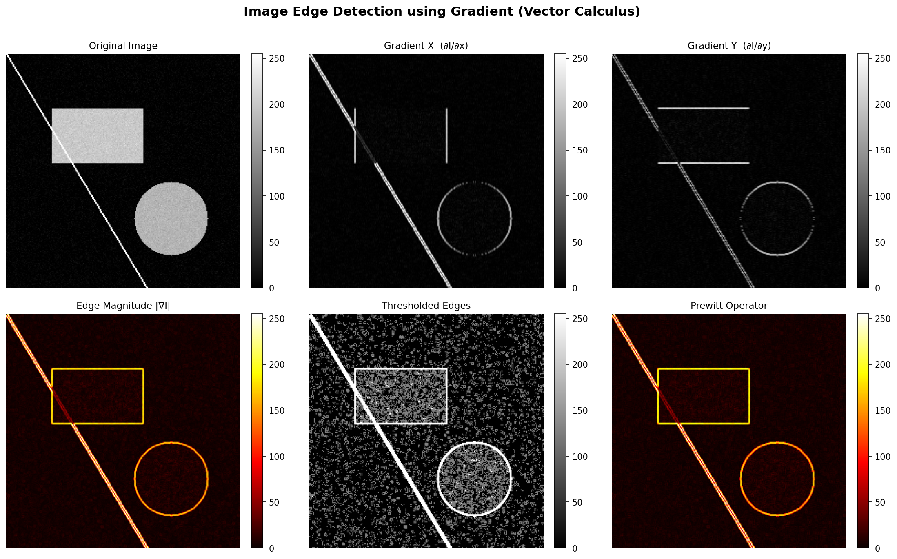
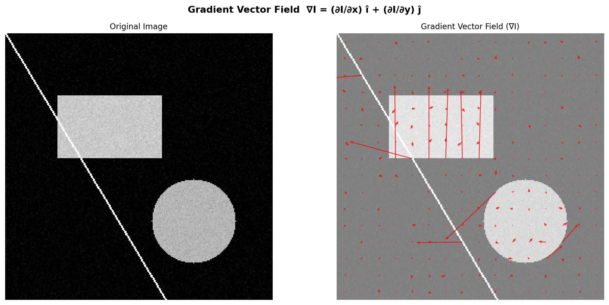
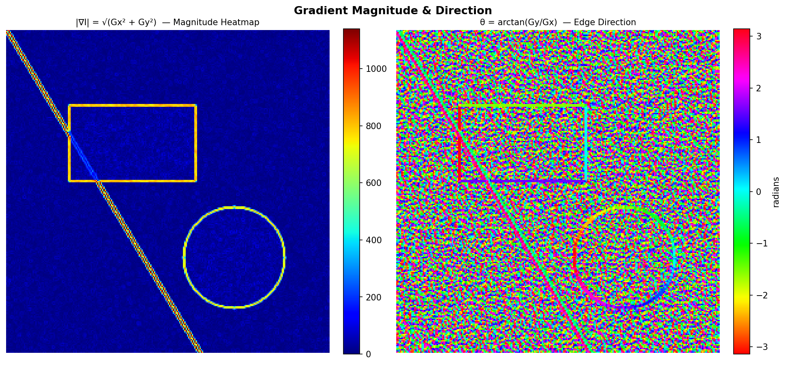
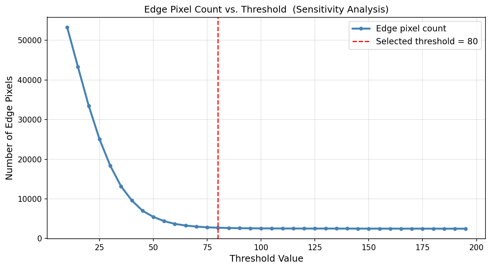

# 🖼️ Image Edge Detection using Gradient (Vector Calculus)

> **4th Semester – Vector Calculus Practical Project**  
> **Topic 4:** Image Edge Detection using Gradient

---

## 📌 Problem Statement

An image can be modelled as a 2D scalar field `I(x, y)`. Edges in an image occur where pixel intensity changes sharply — mathematically, where the **gradient** of the image function is large.

This project implements **image edge detection** using vector calculus concepts — computing the gradient vector field of an image to detect edge locations, strengths, and orientations.

---

## 🧮 Vector Calculus Concepts Used

| Concept | Formula | Application |
|---|---|---|
| Scalar Field | `I(x, y) ∈ [0, 255]` | Image modelled as 2D scalar field |
| Gradient | `∇I = (∂I/∂x) î + (∂I/∂y) ĵ` | Direction of max intensity change |
| Partial Derivatives | `∂I/∂x`, `∂I/∂y` | Horizontal & vertical edge detection |
| Magnitude | `\|∇I\| = √(Gx² + Gy²)` | Edge strength at each pixel |
| Direction | `θ = arctan(Gy / Gx)` | Edge orientation angle |
| Vector Field | `∇I` plotted as quiver | Visual representation of gradients |

---

## 📁 Project Structure

```
vector-calculus-edge-detection/
│
├── edge_detection.py                  # Main Python implementation
├── vector_calculus_project_topic4.docx  # Full project report (Word)
├── README.md                          # This file
│
└── output_figures/                    # Generated after running the code
    ├── fig1_main_comparison.png       # Original → Gx → Gy → Edges
    ├── fig2_vector_field.png          # Gradient vector field (quiver)
    ├── fig3_magnitude_direction.png   # Magnitude heatmap + direction map
    └── fig4_threshold_analysis.png   # Threshold sensitivity analysis
```

---

## ⚙️ How to Run

### 1. Install dependencies
```bash
pip install numpy matplotlib scipy pillow
```

### 2. Run the script
```bash
python edge_detection.py
```

### 3. Output
- 4 figures saved in `output_figures/` folder
- Summary statistics printed in the terminal

---

## 📊 Output Results

```
Image size          : 256 x 256 pixels
Max gradient mag    : 1139.48
Mean gradient mag   : 47.90
Strong edges (>80)  : 2,717 pixels
Weak edges (30–80)  : 15,648 pixels
Gradient directions : min=-π rad, max=+π rad
```

---

## 🖼️ Sample Output

### Figure 1 — Main Comparison
Shows the original image alongside Gx, Gy, edge magnitude, thresholded edges, and Prewitt operator results.




### Figure 2 — Gradient Vector Field
Red arrows visualise `∇I` at sampled points — each arrow points perpendicular to the edge contour.



### Figure 3 — Magnitude Heatmap & Direction Map
- **Jet heatmap** — brighter = stronger edge
- **HSV colormap** — different hues = different edge orientations



### Figure 4 — Threshold Sensitivity Analysis
Shows how edge pixel count changes with different threshold values.

 


---

## 🛠️ Operators Used

### Sobel Operator (Primary)
```
Kx = [[-1, 0, 1],      Ky = [[-1, -2, -1],
      [-2, 0, 2],             [ 0,  0,  0],
      [-1, 0, 1]]             [ 1,  2,  1]]
```

### Prewitt Operator (Comparison)
```
Kx = [[-1, 0, 1],      Ky = [[-1, -1, -1],
      [-1, 0, 1],             [ 0,  0,  0],
      [-1, 0, 1]]             [ 1,  1,  1]]
```

---

## 🐍 Tech Stack

- **Language:** Python 3
- **Libraries:** NumPy, SciPy, Matplotlib, Pillow

---

## 📄 Documentation

Full project report with mathematical model, algorithm, code, and analysis is available in:  
📎 `vector_calculus_project_topic4.docx`

---

## 👨‍🎓 Subject Info

- **Subject:** Vector Calculus
- **Semester:** 4th Semester
- **Topic:** Image Edge Detection using Gradient
- **Key Concepts:** Gradient, Partial Derivatives, Vector Fields, Sobel Operator